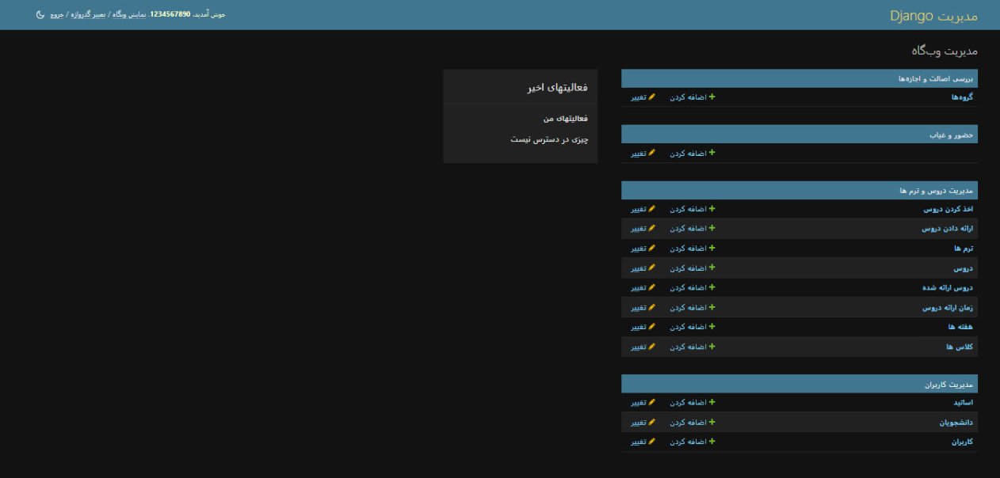

# Student Attendance System Back-End 🏢

## admin panel 🔐:

# 🌟 Student Attendance System 🎓 | English

This project is an attendance system for students developed using **Django Rest Framework**. It is designed to manage and facilitate educational processes, providing various features for users.

## System Features 📚

- **Course Enrollment:** 📖 Allows students to enroll in different courses.
- **Course Offering:** 👨‍🏫 Enables instructors to offer courses.
- **Term Definition:** 📅 Manages and defines academic terms.
- **Course Definition:** 📘 Allows for the definition and management of various courses.
- **Offered Courses:** 📝 View and manage courses offered in each term.
- **Course Schedule:** ⏰ Sets the timings for classes.
- **Week Definition:** 📆 Manages academic weeks and their relation to courses.
- **Class Definition:** 🏫 Allows for the definition of different classes for each course.
- **Instructor Definition:** 👩‍🏫 Records and manages instructor information.
- **Student Definition:** 👨‍🎓 Records and manages student information.

## Project Status 🚀

This project is still under development, and more features will be added soon. Your feedback and suggestions can help improve this system. 💬
---
If you would like to contribute, we would be happy to hear your thoughts and suggestions! 🤝
---
Thank you for your attention! 🌈

# 🌟 سامانه حضور و غیاب دانشجویان 🎓 | persian

این پروژه یک سامانه حضور و غیاب برای دانشجویان است که با استفاده از **Django Rest Framework** توسعه داده شده است. این سامانه به منظور مدیریت و تسهیل فرآیندهای آموزشی طراحی شده و امکانات متنوعی را در اختیار کاربران قرار می‌دهد.

## امکانات سامانه 📚

- **اخذ کردن دروس:** 📖 امکان ثبت‌نام دانشجویان در دروس مختلف.
- **ارائه دادن دروس:** 👨‍🏫 امکان ارائه دروس توسط استادان.
- **تعریف ترم‌ها:** 📅 مدیریت و تعریف ترم‌های تحصیلی.
- **تعریف دروس:** 📘 امکان تعریف و مدیریت دروس مختلف.
- **دروس ارائه شده:** 📝 مشاهده و مدیریت دروس ارائه شده در هر ترم.
- **زمان ارائه دروس:** ⏰ تعیین زمان‌های برگزاری کلاس‌ها.
- **تعریف هفته‌ها:** 📆 مدیریت هفته‌های تحصیلی و ارتباط آن‌ها با دروس.
- **تعریف کلاس‌ها:** 🏫 امکان تعریف کلاس‌های مختلف برای هر درس.
- **تعریف اساتید:** 👩‍🏫 ثبت و مدیریت اطلاعات استادان.
- **تعریف دانشجویان:** 👨‍🎓 ثبت و مدیریت اطلاعات دانشجویان.

## وضعیت پروژه 🚀

این پروژه هنوز در حال توسعه است و به زودی امکانات بیشتری به آن اضافه خواهد شد. نظرات و پیشنهادات شما می‌تواند به بهبود این سامانه کمک کند. 💬

---
اگر تمایل به مشارکت دارید، خوشحال می‌شویم که نظرات و پیشنهادات شما را بشنویم! 🤝
---

با تشکر از توجه شما! 🌈
